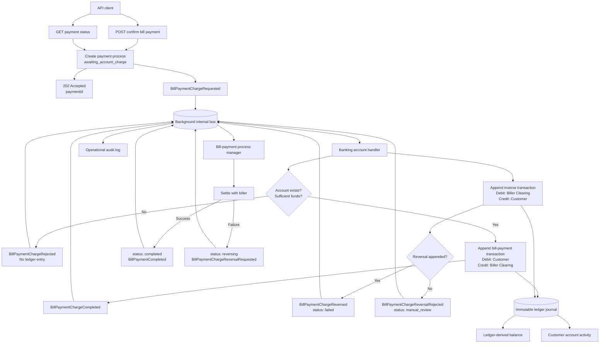

# Immutable Double-Entry Ledger Flow

Bill payment requests account changes through the internal bus. The banking handler alone owns ledger posting, while the payment process manager coordinates biller settlement and compensation.
